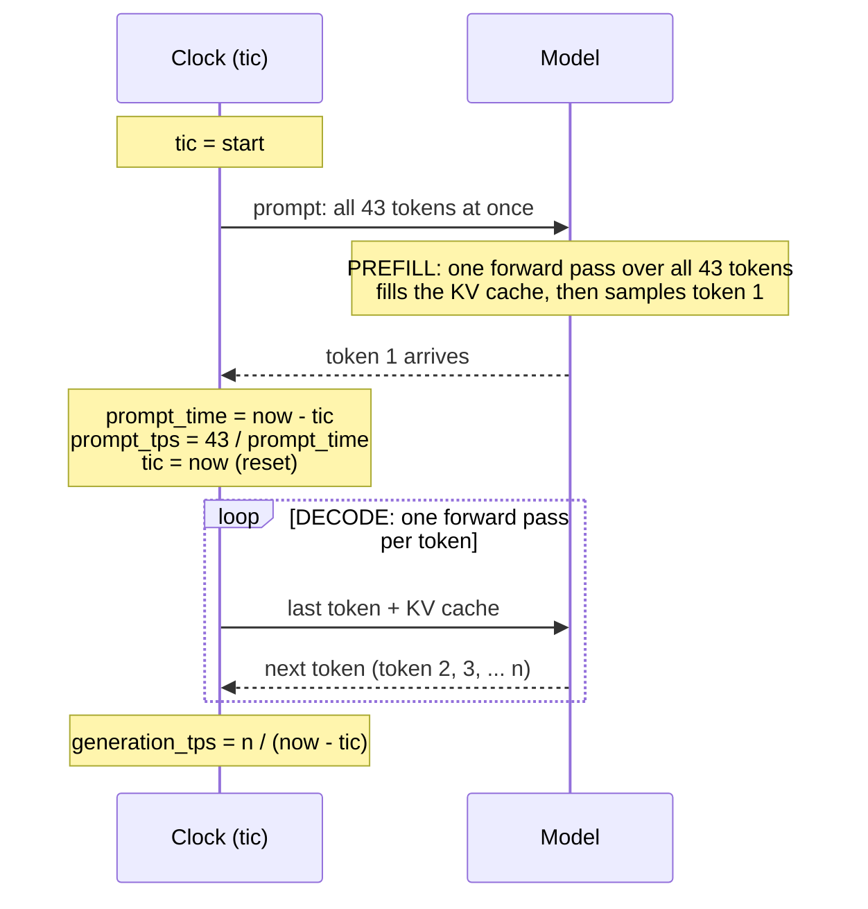

# Week 01: first local model baseline

_Data sections generated by `01-first-model/write_notes.py`._

- model: `mlx-community/Llama-3.2-1B-Instruct-4bit`
- revision: `08231374eeacb049a0eade7922910865b8fce912`
- command: `mlx_lm.generate --model mlx-community/Llama-3.2-1B-Instruct-4bit --prompt 'Explain a matrix in two sentences.' --max-tokens 500` (prompt varies, see `benchmarks/prompts/`)

## Baseline (second run of each prompt)

| prompt | prompt tokens | prompt tok/s | gen tokens | gen tok/s | peak GB | process wall s* |
|---|---|---|---|---|---|---|
| short | 43 | 767.799 | 79 | 266.850 | 0.799 | 1.99 |
| medium | 90 | 1216.567 | 66 | 245.705 | 0.840 | 2.06 |
| long | 234 | 2033.979 | 71 | 259.620 | 0.964 | 2.05 |

\* Launch to exit, includes startup and model load. Not TTFT.

## Plain-text tokenization (no chat template)

| variant | text | words | UTF-8 bytes | tokens | pieces |
|---|---|---|---|---|---|
| original | `Explain a matrix in two sentences.` | 6 | 34 | 8 | `Ex` · `plain` · ` a` · ` matrix` · ` in` · ` two` · ` sentences` · `.` |
| punctuation | `Explain a matrix, in two sentences!` | 6 | 35 | 9 | `Ex` · `plain` · ` a` · ` matrix` · `,` · ` in` · ` two` · ` sentences` · `!` |
| rare-and-number | `Tokenize 3.14159 antidisestablishmentarianism` | 3 | 45 | 13 | `Token` · `ize` · ` ` · `3` · `.` · `141` · `59` · ` ant` · `idis` · `establish` · `ment` · `arian` · `ism` |

The CLI reported 43 prompt tokens for the short prompt vs 8 here: the difference is the chat template's role/control tokens.

## My observation

### Prefill vs decode
- A request has two phases. **Prefill** reads the whole prompt in one parallel forward pass and builds the KV cache (`prompt tok/s`). **Decode** generates one token per forward pass (`generation tok/s`).
- Prefill speed rose with prompt length (768 → 1217 → 2034 tok/s for 43 → 90 → 234 tokens) while decode stayed flat (~245–267 tok/s). Prefill is compute-bound and short prompts don't fill the GPU; decode is memory-bandwidth-bound because every token re-reads all ~700 MB of weights.
- In-process (`bench.py`, model loaded once + warmup) prefill levelled off at ~3,100 tok/s from ~256 tokens up, and decode slowed from ~274 to ~192 tok/s by ~3,800 tokens of context as KV-cache reads grow.
- The CLI's 43-token prefill (~780 tok/s) was about half the in-process number (~1,550 tok/s): one-time per-process costs and no warmup.

### How `prompt tok/s` is measured (mlx_lm `generate.py` lines 722–743)

- Prefill = everything from "start" until the **first** output token. The model reads the whole prompt in one go, so the time depends on prompt length but it's still a single pass.
- `prompt tok/s` = prompt tokens ÷ that time. With 43 tokens in ~28 ms → ~1,550 tok/s (in-process). Same number the CLI prints as `Prompt: 43 tokens, … tokens-per-sec`.
- Token 1 is counted in prefill time, not decode. The decode clock starts after it.
- Prefill time ≈ in-process TTFT (`bench.py`'s `TTFT ms` column agrees). It excludes Python startup and model load, which the CLI's wall time includes.
- Why prefill is fast per token: the 43 tokens share one read of the weights. Decode has to re-read all the weights for every single token.
- mlx reports `peak_memory` as bytes / 1e9 (decimal GB), while `record_env.py` uses 1024³ (GiB). Check which "GB" a tool means.

### What the CLI numbers do and don't measure
- `process wall s` (~2 s) is launch to exit: Python startup + model load + prefill + decode. It is not TTFT. Prefill of the long prompt was only ~0.12 s of it.
- Each CLI run reloads the model, so compare the reported rates, not wall time.
- Run-to-run noise: over 9 identical CLI runs, decode varied <2% (248.9 ± 4.4 tok/s) but short-prompt prefill varied ~6% (775.8 ± 49.0). The first run was slowest (cold start).
- Greedy decoding (temperature 0) gave identical output text on every run.
- `--max-tokens` is a cap, not a target. At 64 every reply was cut mid-sentence (64/64 tokens); at 500 replies stopped naturally at 66–79 tokens, so decode work is no longer identical across rows.

### Memory
- Peak memory ~0.8 GB is mostly the 4-bit weights; it grew to 0.96 GB with the 234-token prompt (KV cache + prefill buffers).
- `hw.memsize` 51,539,607,552 bytes = 48 GiB of unified memory, shared by CPU and GPU. Weights + KV cache + everything else come out of one pool.

### Tokens are not words
- `Explain a matrix in two sentences.` = 6 words → 8 tokens (`Ex`+`plain`; spaces attach to the next token; `.` is its own token).
- Changing only punctuation changed the IDs and the count (8 → 9).
- `Tokenize 3.14159 antidisestablishmentarianism` = 3 words → 13 tokens. Numbers split into ≤3-digit chunks (`3` `.` `141` `59`); rare words split into common pieces.
- English prompts ran ~1.3 tokens/word (178 words → ~234 tokens incl. template).
- The CLI counted 43 tokens for the 8-token plain text: the chat template adds ~35 role/control tokens. Check formatting before blaming the tokenizer.
- Every cost (prefill time, decode time, KV memory, API price) scales with tokens, not words.

### Reproducibility
- The model version is the commit hash in the HF cache's `refs/main` (`08231374…`). Every online load re-checks the Hub and silently updates `refs/main` if the publisher pushed. Use `HF_HUB_OFFLINE=1` or `load(..., revision=<hash>)` to freeze it.
- `snapshots/<hash>/` holds symlinks into `blobs/`, so unchanged files are shared across revisions.

## Questions to revisit after Phase 3 (don't answer yet)

1. Which part took longer with more input?
2. What might change if two users shared the model?
